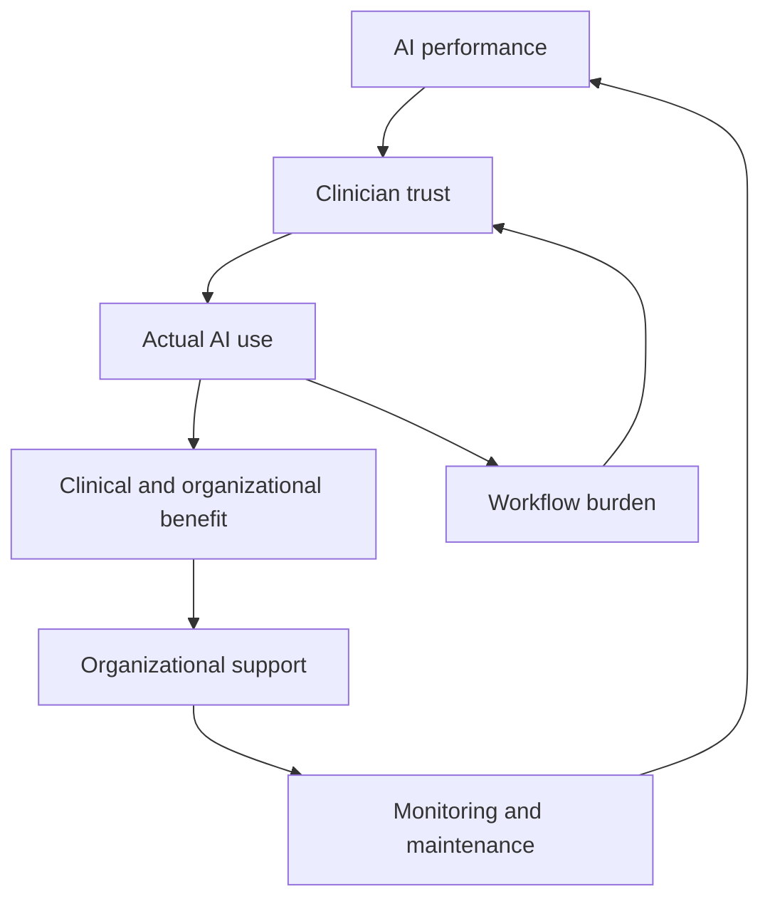

# Sustaining Clinical AI After Deployment

An exploratory system dynamics model of how technical performance, clinician trust and use, workflow conditions and organizational response interact after clinical AI deployment.

> **Research in progress:** This repository is a protected public overview. The complete Model v2 implementation, parameter specification, experiments and manuscript materials will be released after publication or preprint.

## Research question

How do changes in AI technical performance, clinician trust and use, organizational monitoring and maintenance interact over time to determine whether a deployed clinical AI system remains sustainably used?

## Motivation

Strong pre-deployment validation does not guarantee that a clinical AI system will remain reliable or meaningfully used in practice. Performance can change after deployment, clinician trust and workflow fit evolve through experience and organizational monitoring does not automatically translate into effective corrective action.

This project treats sustainability as a dynamic outcome produced by feedback among technical, human and organizational mechanisms.

## Conceptual structure



The model represents six evolving states:

- AI performance
- clinician trust
- actual AI use
- organizational support
- maintenance capacity
- detected performance concern

## Analysis

The project uses:

- stock-and-flow modeling;
- numerical simulation of post-deployment feedback;
- isolated and combined intervention scenarios;
- verification and behavioral tests;
- sensitivity and uncertainty analysis;
- cautious, conditional interpretation rather than hospital-specific forecasting.

The intervention scenarios examine monitoring speed, corrective capacity, workflow support, clinician-facing support, organizational weakness, and coordinated policy packages.

## Runnable toy model

[`toy_model.py`](toy_model.py) is a small, dependency-free simulation of the public conceptual structure. It demonstrates bounded state updates, feedback, delays, and scenario parameters without reproducing the protected Model v2.

```bash
python toy_model.py
python -m unittest test_toy_model.py
```

The script writes a synthetic 60-month trajectory to `toy_trajectory.csv`. It is educational and explanatory—not a clinical forecasting tool.

## Research contribution

Existing work often examines technical drift, clinician acceptance, or organizational adoption separately. This project explores their interaction within one quantitative post-deployment lifecycle model.

The contribution is explanatory rather than predictive: it investigates the conditions under which feedback and delays can support recovery, persistent decline, or functional abandonment.


## Tools

Python · System dynamics · Monte Carlo analysis
